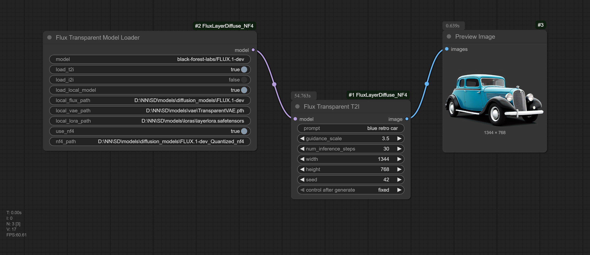

# ComfyUI-FluxLayerDiffuse-NF4

https://github.com/RedAIGC/Flux-version-LayerDiffuse



## Download models
```bash
huggingface-cli download black-forest-labs/FLUX.1-dev --local-dir models/checkpoints/FLUX.1-dev --exclude "flux1-dev.safetensors"

huggingface-cli download priyesh17/FLUX.1-dev_Quantized_nf4 --local-dir models/checkpoints/FLUX.1-dev_Quantized_nf4

wget -O models/vae/TransparentVAE.pth "https://huggingface.co/RedAIGC/Flux-version-LayerDiffuse/resolve/main/TransparentVAE.pth?download=true"

wget -O models/loras/layerlora.safetensors "https://huggingface.co/RedAIGC/Flux-version-LayerDiffuse/resolve/main/layerlora.safetensors?download=true"
```

## Important
Currently, only **T2I mode** is supported!